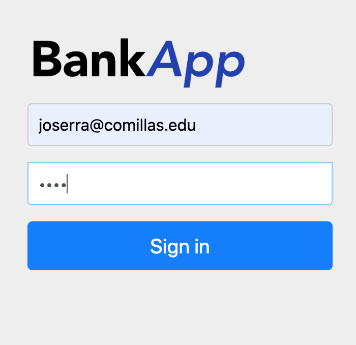
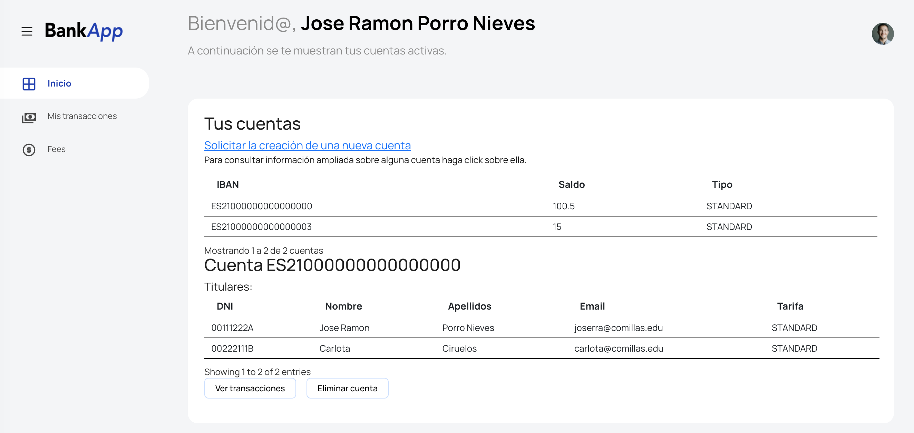
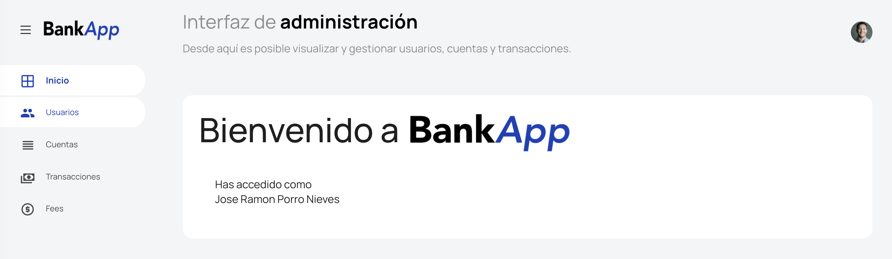

# BankApp
### Práctica Final PAT
#### José Ramón Porro y Carlota Ciruelos
##### 3ºA GITT

BankApp es una aplicación web cuyo objetivo es la gestión de una entidad bancaria y similares.
#### Login (Security and authentication)

El proyecto cuenta con la dependencia de Spring Security configurada. Para acceder al sistema es necesario rellenar un formulario de login personalizado. También se encuentran protegidas las llamadas a las APIs. Además también se emplea para gestionar la sesión de usuario.
##### Encriptación de contraseñas
Las contraseñas de los usuarios se encuentran encriptadas en la base de datos, de esta forma hay más protección frente a ataques a la base de datos.
### Secciones
#### Usuario normal

Una vez introducidos los credenciales, se accede a la página principal donde se da un mensaje de bienvenida personalizado y se muestra un resumen de las cuentas del usuario en cuestión. Se puede cerrar sesión haciendo click en la foto superior derecha.
##### Información ampliada sobre una cuenta
El usuario puede hacer click sobre cualquiera de sus cuentas para ver información más detallada o realizar gestiones.
#### Usuario administrador

En la interfaz de administración se pueden realizar gestiones varias como la creación de usuarios, creación de cuentas, etc. También es posible gestionar todas las cuentas del sistema y también filtrarlas por titulares. En el menú de la izquierda se despliegan las diferentes áreas de gestión.
##### Usuarios

##### Cuentas

##### Transacciones
