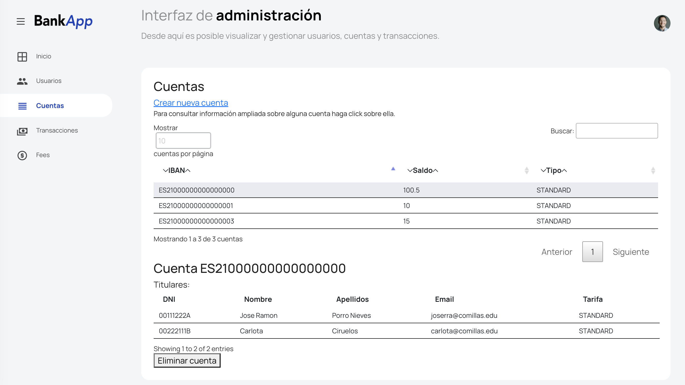

# BankApp
## Práctica Final PAT
#### José Ramón Porro y Carlota Ciruelos
##### 3ºA GITT

BankApp es una aplicación web cuyo objetivo es la gestión de una entidad bancaria y similares.
#### Login (Security and authentication)
##### Credenciales de acceso
joserra@comillas.edu
Contraseña: hola

carlota@comillas.edu
Contraseña: hola

El proyecto cuenta con la dependencia de Spring Security configurada. Para acceder al sistema es necesario rellenar un formulario de login personalizado. También se encuentran protegidas las llamadas a las APIs. Además también se emplea para gestionar la sesión de usuario.
##### Encriptación de contraseñas
Las contraseñas de los usuarios se encuentran encriptadas en la base de datos, de esta forma hay más protección frente a ataques a la base de datos.
### Secciones
#### Usuario normal

Una vez introducidos los credenciales, se accede a la página principal donde se da un mensaje de bienvenida personalizado y se muestra un resumen de las cuentas del usuario en cuestión. Se puede cerrar sesión haciendo click en la foto superior derecha.
##### Información ampliada sobre una cuenta
El usuario puede hacer click sobre cualquiera de sus cuentas para ver información más detallada o realizar gestiones.
#### Usuario administrador

En la interfaz de administración se pueden realizar gestiones varias como la creación de usuarios, creación de cuentas, etc. También es posible gestionar todas las cuentas del sistema y también filtrarlas por titulares. En el menú de la izquierda se despliegan las diferentes áreas de gestión.
##### Usuarios

##### Cuentas

Desde la pestaña de cuentas se ofrece una tabla con todas las cuentas que incorpora ordenado por varios campos ascendente y descendente así como una útil barra de búsqueda. Los mensajes de la tabla se encuentran personalizados.
##### Transacciones

###Scafolding del proyecto
Dividimos la carpeta de  main en:
- Dentro de com.icai.BankApp la dividimos por capas: 
    1. Config
    2. Controller: definimos los endpoints
    3. Domain: entidades del proyecto
    4. DTO
    5. Repository: conectamos con la BD
    6. Service: conecta el controlador con el respositorio
- Resources:   
    1. Contiene my_data.sql, schema.sql y propierties.
    2. Static: con división en css, js y html
    
### Bases de datos
Hay cinco tablas: USER, ACCOUNTS, ACCOUNT_USER, TRANSACTION y FEES. 
Esas cinco tablas son la base de nuestra aplicación, sobre ellas se construyen las entidades de nuestra aplicación.
#### Relacion 'many to many' de ACCOUNT y USER

Hay una tabla intermedia de relación entre las tablas ACCOUNT y USER dado que tienen una relación n a m. Siendo necesario realizar dos inner join. 

### Test: 
(22 tests)
- E2E: son la mayoria y comprueban que se ejecuten los diferentes métodos del flujo de manera correcta.
- Unitarios: comprueban clases por separado. Lo empleamos para comprobar el uso del @Pattern en el email del User

### Seguridad
- Encriptamos la contraseña para salvaguardar la privacidad del usuario
- Además hacemos validaciones @Pattern para parámetros como email

